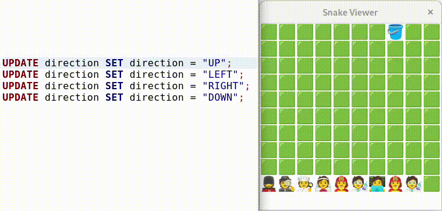

# mysql-snake

Classic video game revived with a new story, now available for
your MySQL database.

A supermarket is giving out free buckets to visitors. Each receiver of
a bucket shows their brand new pail to two friends, who naturally rush
to the supermarket to get buckets of their own. Your task is to make
sure nobody gets hurt as the entire town flocks to get their free
bucket.

## Fake testimonials
"Work has never been so fun." — Intern at some company

"What's up with our website?" —  CEO at that same company

"Get a life." —  Grandmother from Pihtipudas

## How can I play?

Load the contents of bucket_game.sql into a MySQL database. Start the
game loop by enabling the gameLoopEvent scheduled event. The game is
initialized or restarted by calling the initGame stored
procedure. gameLoopEvent is not automatically disabled when the game
ends.

To change direction, set the direction column of the first row in the
direction table to equal "UP", "DOWN", "LEFT", or "RIGHT".

## How can I see what I play?

mysql-snake comes with a stored procedure, renderGame, that outputs
the current game state represented with emojis in an UTF-8
string. renderGame can be used from any MySQL client, or with the
snakeviewer program in this repository. To use snakeviewer, edit the
connection information at the top of snakeviewer.c to fit where you
want to connect, and then make && ./snakeviewer. snakeviewer calls
renderGame 4 times per second and displays the result in a GTK
TextView.

## Dependencies

### mysql-snake

MySQL 8.0 is required to run the game. MySQL 5.7 might work too but I
have not tried it. A font with emojis is required to see the game.

### snakeviewer
* mysqlclient
* gtk4
* libbsd
